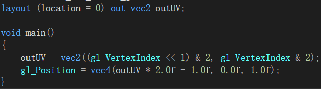
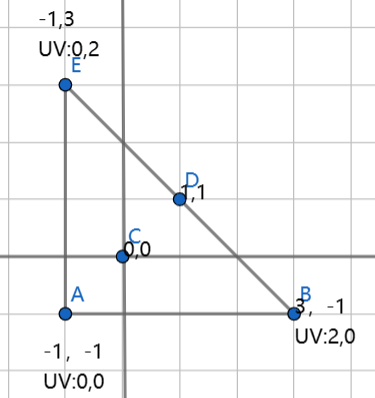

### **1.Gbuffer后的UV坐标**

取自SaschaWillems的vulkan sample

在处理好Gbuffer后在下一个pass的shader对Gbuffer进行采样时，发现UV坐标不知道该怎么获取了，在正向渲染中UV坐标直接用模型的UV就可以进行所有的采样并输出颜色，在延迟渲染中因为顶点输入进来的UV坐标采样完成后保存为世界空间坐标的时候并没有保存UV信息，而且也不需要UV信息，我们只需要根据屏幕这个长方形的形状对纹理进行采样就可以了，那么问题就来了，我们采样需要UV那么这个UV该怎么计算。

vulkan中我们gbuffer pass 后的pass并不需要任何顶点信息在绑定好pipeline和一些其他信息后，直接使用

```
vkCmdDraw(drawCmdBuffers[i], 3, 1, 0, 0);
```

就可以提交渲染，而参数中vertexCount表明了我们有三个顶点，三个顶点可以构成一个三角形，这个三角形就是我们获取UV的关键。

裁剪空间进行齐次除法后的坐标范围是1,-1 ,我们需要的UV范围是(0,0) (1,0) (1,1) (0,1)。所以只需要让这个三角形覆盖整个裁剪空间，并且让UV均匀分布.

上面的计算出来的三角形样貌



在插值后正好可以让UV坐标均匀的覆盖整个矩形，于是我们就获得了片段着色器中需要的UV了
