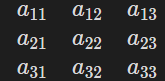
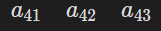

法线变换矩阵的推导

正常的变换矩阵都是4*4的矩阵

$$
变换矩阵=\left[\begin{array}{ccc|c}
a_{11}&a_{12}&a_{13}&a_{14}\\
a_{21}&a_{22}&a_{23}&a_{24}\\
a_{31}&a_{32}&a_{33}&a_{34}\\
\hline
a_{41}&a_{42}&a_{43}&a_{44}
\end{array}\right]
$$

控制旋转缩放切变控制平移控制投影变换 $a_{44}$控制整体的缩放

二法线只是一个向量只有方向不需要平移和投影之类的所以只需要3*3的旋转缩放矩阵

法线在不成比例的缩放时会导致法线的方向改变，

而法线跟模型一起缩放时，往往会导致法线的方向改变而不跟模型表面垂直

所以为了让法线进行正确的变换，那么对法线就要对法线进行相反的变换，即法线的缩放矩阵应为模型缩放矩阵的逆矩阵

法线的旋转矩阵还应该保持原本的旋转

旋转矩阵是正交矩阵，所以旋转矩阵的转置就同等与他的逆矩阵，但是缩放矩阵不是正交矩阵，不能通过转置求逆矩阵
